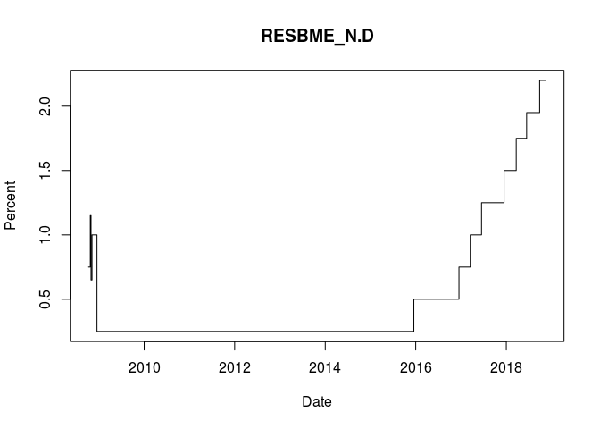
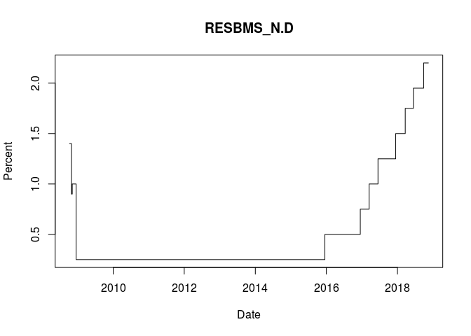

<!-- README.md is generated from README.Rmd. Please edit that file -->
ddptools
========

The goal of ddptools is to make it easier to process economic data published by Federal Reserve.

The Federal Reserve Board (FRB) has been publishing US Economic data [since 1914](https://www.federalreserve.gov/econresdata/feds/2016/files/2016016pap.pdf). Many of the current [statistical releases](https://www.federalreserve.gov/data.htm) are available for download via the [Data Download Program](https://www.federalreserve.gov/datadownload/) (DDP)--an application interface built around XML files (in [SDMX](https://sdmx.org/) 1.0 format). The `ddptools` package is intended to make it easier to process and make use of these data.

Installation
------------

``` r
devtools::install_github("damianrt/ddptools")
```

Example
-------

The PRATES release: [Interest on Required Reserve Balances and Excess Balances](https://www.federalreserve.gov/monetarypolicy/reqresbalances.htm)

-   Download the entire release in a zip file
-   Extract the XML data
-   Import it into R

``` r
library(ddptools)
library(magrittr)

release_key <- "PRATES"

db <- release_key %>%
    download_zip(dir = ".", quiet = TRUE) %>%
    extract_xml(exdir = ".") %>%
    read_ddp()
```

Or read the XML file directly

``` r
db <- read_ddp("PRATES_data.xml")
```

The result is a list of tis objects. The name of each list element corresponds to the `series_name` attribute for the corresponding series in the XML data. This particular release contains two time series.

``` r
names(db)
#> [1] "RESBME_N.D" "RESBMS_N.D"
```

Recent observations

``` r
tail(db$RESBME_N.D)
#>             
#> 20181110 2.2
#> 20181111 2.2
#> 20181112 2.2
#> 20181113 2.2
#> 20181114 2.2
#> 20181115 2.2
#> class: tis
```

Metadata are stored as attributes of each tis object.

``` r
str(db$RESBME_N.D)
#> Class 'tis'  atomic [1:3690] 0.75 0.75 0.75 0.75 0.75 0.75 0.75 0.75 0.75 0.75 ...
#>   ..- attr(*, "start")=Class 'ti'  num 1e+13
#>   ..- attr(*, "currency")= chr "NA"
#>   ..- attr(*, "freq")= chr "8"
#>   ..- attr(*, "int_rates_paid")= chr "IOR"
#>   ..- attr(*, "unit")= chr "Percent"
#>   ..- attr(*, "unit_mult")= chr "1"
#>   ..- attr(*, "short_description")= chr "Interest rate on excess reserves (IOER rate), Last Changed 09-27-2018"
#>   ..- attr(*, "long_description")= chr "Interest rate on excess reserves (IOER rate)"
```

Release Keys
------------

Each statistical release is identified by an alphanumeric "release key" which can be found in the url for the release (e.g.: <https://www.federalreserve.gov/datadownload/Choose.aspx?rel=PRATES>). Based on this identifier, the `download_zip` function locates and retrieves a zip file. All of the statistical release keys that are known to ddptools are available through a lookup function, which also documents their full names. For more about the origins of these identifiers, refer to the [FEDS Note](https://www.federalreserve.gov/econresdata/feds/2016/files/2016016pap.pdf) on the subject.

Known release keys

``` r
ddptools::lookup_release_name() %>% 
    names() %>%
    sort()
#>  [1] "CHGDEL" "CP"     "E2"     "FOR"    "G17"    "G19"    "G20"   
#>  [8] "G20"    "H10"    "H15"    "H3"     "H41"    "H6"     "H8"    
#> [15] "PRATES" "SCOOS"  "SLOOS"  "Z1"
```

Release name by key

``` r
ddptools::lookup_release_name("Z1")
#> [1] "Financial Accounts of the United States (Z.1)"
```

Working with `tis` objects
--------------------------

The [tis package](https://cran.r-project.org/web/packages/tis/index.html) was originally developed by Jeff Hallman, an economist at the Federal Reserve. tis objects are numeric vectors with an attribute (start) to manage time indexing. The plots below make use of the `ti()` function to retrieve the time index, and `attr()` to retrieve individual attributes. Otherwise, tis objects work just like any other numeric vector.

``` r
plot(
    x    = as.Date(tis::ti(db$RESBME_N.D)),
    y    = db$RESBME_N.D,
    type = "s",
    main = "RESBME_N.D",
    xlab = "Date",
    ylab = attr(db$RESBME_N.D, "unit")
)

plot(
    x    = as.Date(tis::ti(db$RESBMS_N.D)),
    y    = db$RESBMS_N.D,
    type = "s",
    main = "RESBMS_N.D",
    xlab = "Date",
    ylab = attr(db$RESBMS_N.D, "unit")
)
```



``` r
summary(db$RESBME_N.D)
#>    Min. 1st Qu.  Median    Mean 3rd Qu.    Max. 
#>  0.2500  0.2500  0.2500  0.5093  0.5000  2.2000
```

``` r
lm(RESBMS_N.D ~ lag(RESBME_N.D), db)
#> 
#> Call:
#> lm(formula = RESBMS_N.D ~ lag(RESBME_N.D), data = db)
#> 
#> Coefficients:
#>     (Intercept)  lag(RESBME_N.D)  
#>        0.001469         1.003821
```

``` r
arima(db$RESBMS_N.D, c(0, 0, 1))
#> 
#> Call:
#> arima(x = db$RESBMS_N.D, order = c(0, 0, 1))
#> 
#> Coefficients:
#>          ma1  intercept
#>       0.9757     0.5131
#> s.e.  0.0028     0.0083
#> 
#> sigma^2 estimated as 0.06514:  log likelihood = -198.39,  aic = 402.77
```

The tis package provides useful functions for time-aware calculations

-   lag
-   diff
-   arithmetic
-   frequency conversions
-   non-overlapping timeframes

<!-- -->

    t <- ti(db$RESBME_N.D)
    newseries <- 100 * (db$RESBME_N.D[t] - db$RESBME_N.D[t-10])

Data Frame
----------

For those who prefer data frames, conversion can be accomplished with tidyverse functions

### Metadata

``` r
series_metadata <- names(db) %>%
    map_df(function(x) {
        metadata <- attributes(db[[x]])
        metadata[["series_name"]] <- x
        metadata[["start"]] <- as.POSIXct(metadata[["start"]])
        metadata[["class"]] <- NULL
        as.data.frame(metadata, stringsAsFactors = FALSE)
    }) 

str(series_metadata)
#> 'data.frame':    2 obs. of  9 variables:
#>  $ start            : POSIXct, format: "2008-10-09 23:59:59" "2008-10-09 23:59:59"
#>  $ currency         : chr  "NA" "NA"
#>  $ freq             : chr  "8" "8"
#>  $ int_rates_paid   : chr  "IOR" "IOR"
#>  $ unit             : chr  "Percent" "Percent"
#>  $ unit_mult        : chr  "1" "1"
#>  $ short_description: chr  "Interest rate on excess reserves (IOER rate), Last Changed 09-27-2018" "Interest rate on required reserves (IORR rate), Last Changed 09-27-2018"
#>  $ long_description : chr  "Interest rate on excess reserves (IOER rate)" "Interest rate on required reserves (IORR rate)"
#>  $ series_name      : chr  "RESBME_N.D" "RESBMS_N.D"
```

### Data

``` r
series_data <- names(db) %>%
    map(function(x) {
        df <- data_frame(
            as.Date(tis::ti(db[[x]])), 
            as.numeric(db[[x]])
        )
        names(df) <- c("date", x)
        df
    }) %>%
    reduce(.f = full_join, by = "date")
```

``` r
series_data 
#> # A tibble: 3,690 x 3
#>          date RESBME_N.D RESBMS_N.D
#>        <date>      <dbl>      <dbl>
#>  1 2008-10-09       0.75        1.4
#>  2 2008-10-10       0.75        1.4
#>  3 2008-10-11       0.75        1.4
#>  4 2008-10-12       0.75        1.4
#>  5 2008-10-13       0.75        1.4
#>  6 2008-10-14       0.75        1.4
#>  7 2008-10-15       0.75        1.4
#>  8 2008-10-16       0.75        1.4
#>  9 2008-10-17       0.75        1.4
#> 10 2008-10-18       0.75        1.4
#> # ... with 3,680 more rows
```
